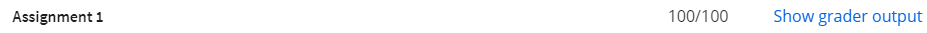

# Week 1
## Learning Objectives
- Understand basic machine learning concepts and workflow
- Distinguish between different types of machine learning tasks, based on examples of how they are applied to real-world problems
- Understand how a basic classification algorithm (k-nearest neighbors) learns and makes predictions
- Build and evaluate a basic k-nearest neighbors classifier on an example dataset using Python and scikit-learn


### Grader Output:


```This assignment was graded with Grader version 2018.01.10a 
If you don't understand the grader message, or believe the message to be inaccurate, please see the discussion forums for details on the grader limitations. 
See the course resource Jupyter Notebook FAQ page for more details on limitations of the autograder.
NOTE: If you have the line %matplotlib notebook or you are using import matplotlib.pyplot as plt in your solution,
you MUST REMOVE IT or comment it out before submitting for grading.
Detected Jupyter notebook submission.
----------

Function answer_one was answered correctly, 0.125 points were awarded.
['Warning, your solution for column target is of type int64, but the autograder is of type float64. Attempting to convert for grading.']
Function answer_two was answered correctly, 0.125 points were awarded.
Function answer_three was answered correctly, 0.125 points were awarded.
['Warning, your solution is of type int64, but the autograder is of type float64. Attempting to convert for grading.']
Function answer_four was answered correctly, 0.125 points were awarded.
['Warning, your solution is of type int64, but the autograder is of type float64. Attempting to convert for grading.']
['Warning, your solution is of type int64, but the autograder is of type float64. Attempting to convert for grading.']
Function answer_five was answered correctly, 0.125 points were awarded.
Function answer_six was answered correctly, 0.125 points were awarded.
Function answer_seven was answered correctly, 0.125 points were awarded.
Function answer_eight was answered correctly, 0.125 points were awarded.
```